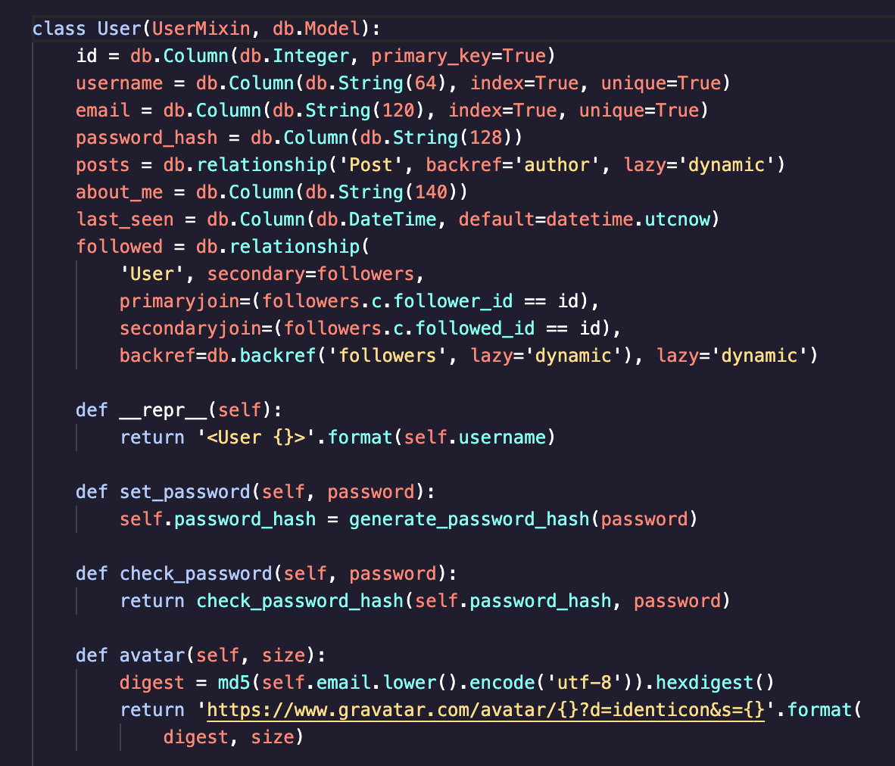
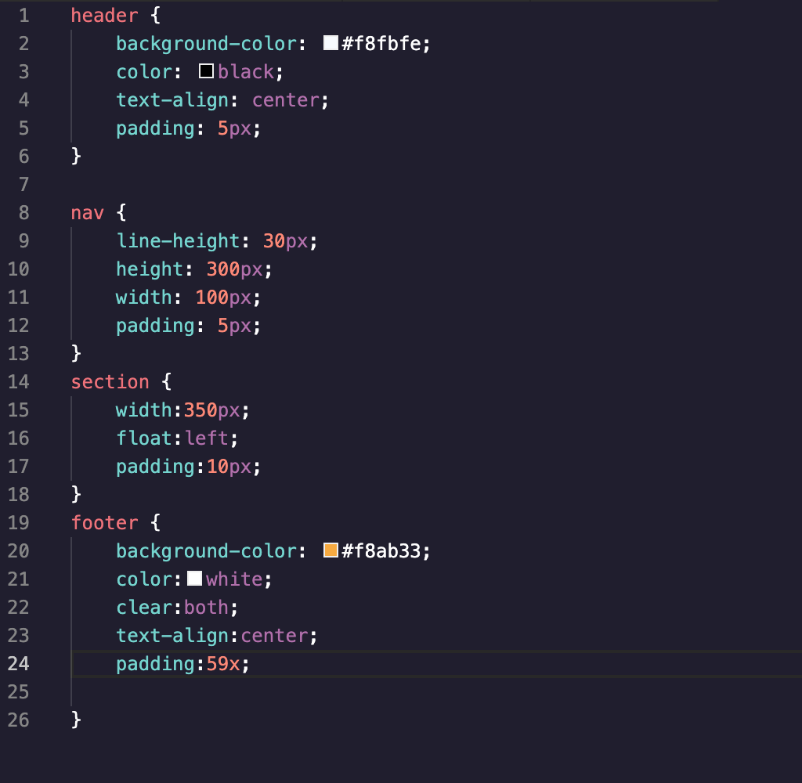
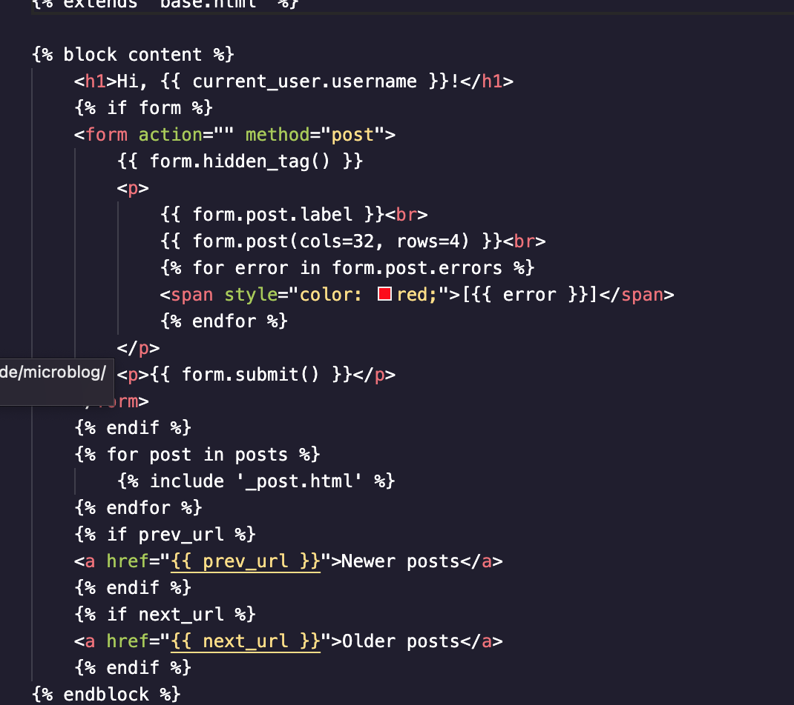

# README

This is a VS Code Theme based on the syntax highlighting of Codecademy.com. The theme has been optomized for CSS/ HTML/ and Python. Unfortunately, I have not optomized the theme for JavaScript - yet. By all means, feel free to help with that! Just be careful not to break the theme for the other languages. It is not perfect, it's as close as I could get (without throwing the computer at the wall).

PLEASE NOTE: If you see punctuation in your code (such as brackets that seem to be the wrong colors - you may need to turn off bracket pair colorization. See this link:

https://stackoverflow.com/questions/45741843/how-do-i-change-comma-and-bracket-colors-in-vs-code

Please open package.json for editing theme tokens for other languages. To edit this theme, you can find the repo on my GitHub. 

https://github.com/jeffmaho/codecademytheme/tree/main/codecademy-theme

